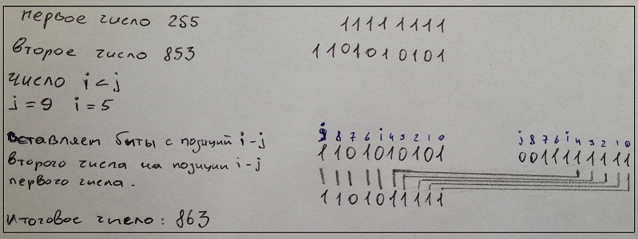

#### Задание EPAM.Summer.Day3

##### Задание 1.
• Разработать unit-тесты (NUnit и (или) MS Unit Test) для тестирования метода Ньютона вычисления корня n-ой степени числа (задание предыдущего дня).
##### Задание 2.
• Разработать unit-тесты (NUnit и (или) MS Unit Test)  для тестирования методов Евклида и Стейна (бинарный алгоритм Эвклида) для расчета НОД двух целых чисел.
##### Задание 3.
• Даны два целых знаковых числа и две позиции битов i и j (i < j). Реализвовать алгоритм вставки одного числа в другое так, чтобы второе число занимало позицию с бита j по бит i (биты нумеруются справа на лево!). Написать unit-тесты для проверки работоспособности указанного алгоритма.
###### Реализация заданий 1 и 2 находится [здесь](https://github.com/ryzhykhdmitry/EPAM.Summer.Ryzhykh.Day2).

Задание 3 я понял и реализовал следующим образом

